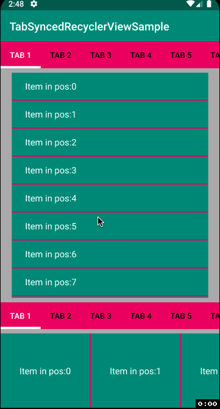

# Tab Synced Recycler View
[](https://jitpack.io/#omid-io/tab-synced-recycler-view)

## Getting start with TabSyncedRecyclerView

#### Step 1. Add the JitPack repository to your build file

Add it in your root build.gradle at the end of repositories:

```groovy
  allprojects {
     repositories {
       ....
       maven { url 'https://jitpack.io' }
     }  
  }
```
  
#### Step 2. Add the dependency
```groovy
  dependencies {
      implementation 'com.github.omid-io:tab-synced-recycler-view:<version>
  }
```

List of versions available can be found at https://jitpack.io/#omid-io/tab-synced-recycler-view.

#### Step 3. Either add the TabSyncedRecyclerView to your layout xml or programmmatically create an instance and add the required setup.
```kotlin
      val tabLayout = findViewById<TabLayout>(R.id.tab_layout)
      val recyclerView = findViewById<TabSyncedRecyclerView>(R.id.recycler_view)

      // pass the tab layout reference
      recyclerView.setTabLayout(tabLayout)
      
      // pass a list containing the # of items in each tab where the count passed in pos 0 corresponds 
      // to the # of items in the first tab (tab pos 0)
      // e.g. Given the following scenario: 
      // 1.) TabLayout has 3 tabs
      // 2.) The data set size is 12 items 
      // 3.) the first 3 items belong to tab 1, the next 2 belong to tab 2, and the last 7 items belong to tab 3
      recyclerView.setCountItemsByTabIndex(listOf(3, 2, 7))

      // pass an instance of the TabSyncedScrollListener
      recyclerView.addOnScrollListener(TabSyncedScrollListener())
      
      // pass an instance of the LinearLayoutManagerWithSmoothScroller
      recyclerView.layoutManager = LinearLayoutManagerWithSmoothScroller(context, RecyclerView.VERTICAL, false)

      recyclerView.adapter = <your adapter instance>
```


## Demo




## License
